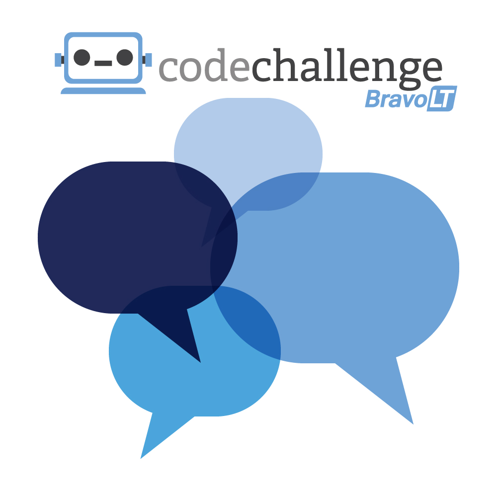

## The Electronic Messaging Challenge
I/O Extended GR Platinum Sponsor Bravo LT is excited to announce our Code Challenge just in time for the big event!

This year our theme is "electronic messaging."  Messaging is an integral part of our everyday lives, and today the vast majoriy of that messaging happens electronically.  Whether by SMS, chat, email, tweet, or other social networking, it is safe to say that electronic messaging is the preferred communication medium of this generation.   

### What can I win?
This year we have a ton of great prizes, including an ASUS ZenWatch 2, a Raspberry Pi 3, a Chromecast, or Chromecast Audio. Participants at the conference are welcome to submit entries via this Github repository.  Winners will be drawn at 3:30pm on Wednesday, May 18th.  Notifications will be done by text or email, and you must pick up your prize at the Bravo LT booth by 6pm.

### How do I enter?
Entries are granted based upon the challenges you solve.  They are numbered in order of complexity, so challenge 1 is the easiest and is worth 1 entry.  Challenge 2 is worth 2 entries.  Challenge 3 is the most complex and is worth three entries.  Therefore, the maximum number of entries an individual can have is 6. You may solve as many of the challenges as you like; however, all entries MUST be pushed to GitHub by 3pm on Wednesday, May 18th. Each individual winner may only receive one prize.

### Instructions
1. Clone this repository, which can be found at https://github.com/BravoLT/GoogleIO2016-CodeChallenge
2. Create a branch for your changes. Branch name is not important.
3. Complete as many of the challenges as you can.  
  * For challenges that require an input file, you will be provided a sample file. We will test it against a separate file (same file will be used for all entries) for the final result.
  * Each challenge should provide a script to execute it.  This script should run any commands required to build the code and then run it.  For example, a solution written in Java and using Maven should run the Maven build and then execute it.
4. Push your branch to the main repository and create a pull request. The pull request should contain your full name, mobile number, and email address.

#### GOOD LUCK AND HAVE FUN!

